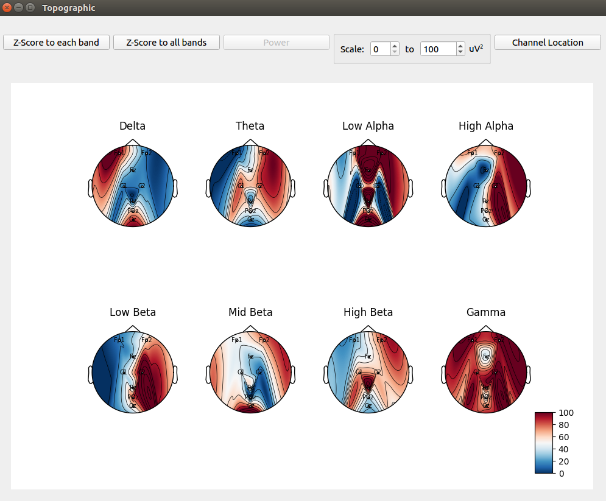

# EEG-gui
A real-time electroencephalography (EEG) and file recorder support various format

# Tech
* Main App & File Recorder
    * Python
        * PyQt5
        * PyQtChart
        * Matplotlib
        * tornado
        * WebSocket
        * scipy
* Robust Mock Data Server
    * Node.js
        * WebSocket

# Features
* Main Panel

* Real-Time EEG display

* High resolution: 250Hz, 24bit
* File Recording with the following format supported:
    * `.csv`
    * `.bdf`
    * `.edf`
    * `.gef`
